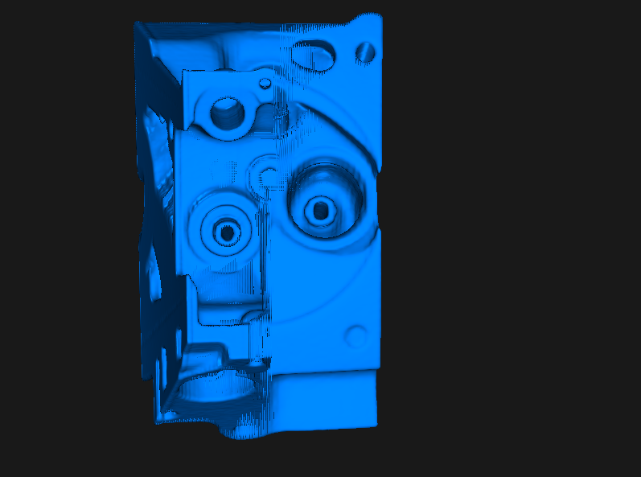
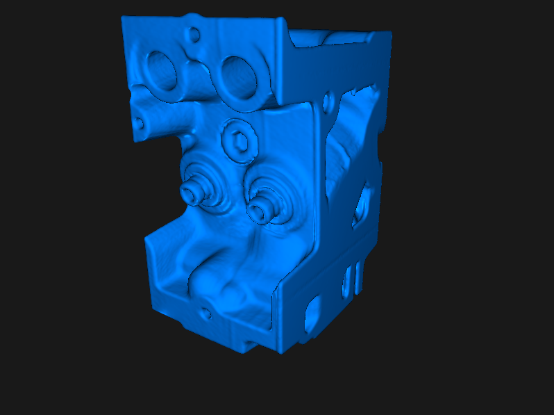
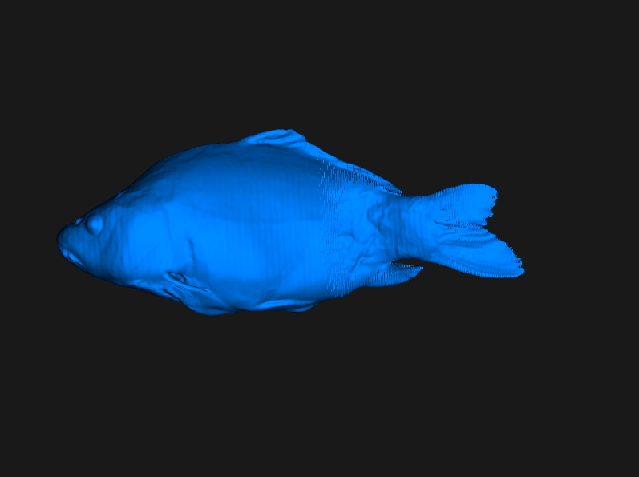
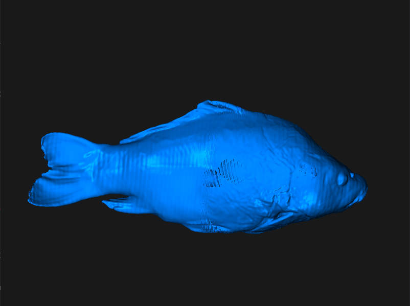
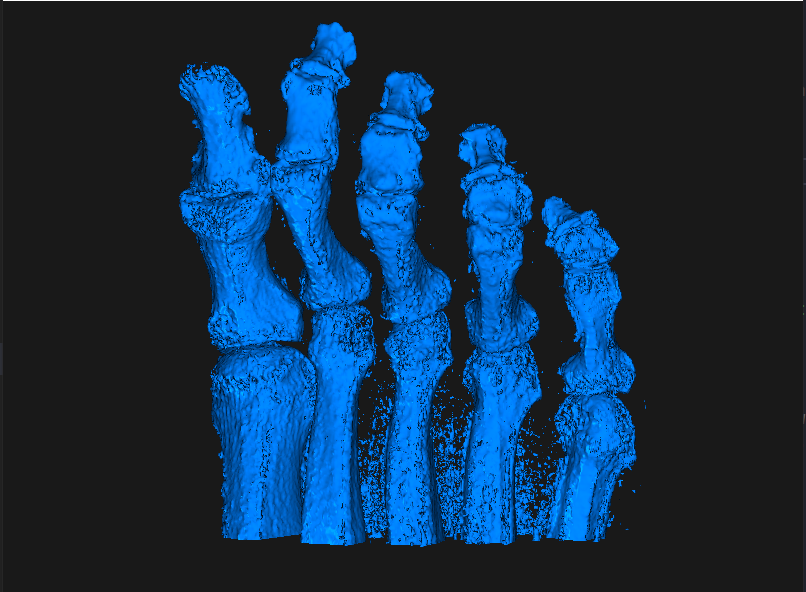

# Isosurface
00957016   高敬庭
## Method
+ 使用Marching-Cube來重建iso-surface
+ 計算各點gradient作為法向量
+ 將頂點以及法向量存入vao中，透過GPU加速渲染
## review
本次作業我認為最難的部分在讀檔，由於檔案資訊繁多，必須將不同種資料作相對應的處理，成功將raw檔讀入資料結構後則必須確保檔案是否正確讀入，畢竟檔案量非常龐大不易除錯，沒問題後只需對該筆資料進行計算後即可求出isosurface。
在完成後我有遇到以下問題，在移動相機到某個角度後某個面會被削掉，我認為是被相機切掉造成的，但因為是出現在特定面才有，所以不確定是bug還是相機造成的。

## Result

